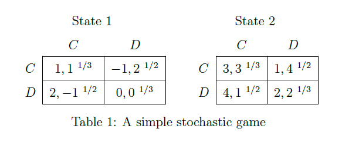

```{r setup, include=FALSE}
knitr::opts_chunk$set(echo = TRUE, error=TRUE, cache=!TRUE)
library(dyngame)
library(RSGSolve)
library(dplyr)
library(R.cache)
```

In this internal report, we numerically compare the algorithm to solve stochastic games with monetary transfers by Goldl?cke and Kranz (2016) (GK) with the algorithm to solve stochastic games with just a public correlation device by Abreu, Brooks, Sanikov (2016) (ABS).

The ABS algorithm is implemented in C++ library SGSolve by Ben Brooks [http://www.benjaminbrooks.net/software.shtml](http://www.benjaminbrooks.net/software.shtml), and an R interface is in the package RSGSolve [https://github.com/skranz/RSGSolve](https://github.com/skranz/RSGSolve)

The GK algorithm is implemented in the R package dyngame: 
[https://github.com/skranz/dyngame](https://github.com/skranz/dyngame)
The dyngame package also contains links to RSGSolve that easily allow to compare the equilibrium payoff sets with and without monetary transfers.


## Two State PD Game



We first want to compare the algorithm with the simple two-state PD game from ABS (p. 11).

The following function specifies the relevant variables to solve the game with transfers using the dyngame package.

```{r}
abs.pd.game = function(delta=2/3) 
{

  # act.fun specifies the action set for a given state xv
  # val = numerical values of actions
  # lab = labels of actions
  act.fun = function(xv,m=NULL) {
    restore.point("act.fun")
		val = list(1:2,1:2)
		lab = list(c("C","D"),c("C","D"))
    list(val=val,lab=lab, i=c(1,2))
  }
  
  # Stage game payoff function
  # Specifies the stage game payoffs as a function
  # of the action profile av and state xv
  # The function must be vectorized, i.e. avm and xvm
  # are matrices of action profiles and states
  g.fun = function(avm,xvm,m=NULL) {
    restore.point("g.fun");
  	
		# Payoff matrices state 1
		g1 = matrix(c(2, 3, -1,0),2,2) # player 1
		g2 = t(g1) # player 2
		
		g = cbind(g1[avm], g2[avm])
		
		# In state 2 payoffs are just by 2 larger
		g[xvm==2] = g[xvm==2] + 2
		return(g)
  }

  # State transitions
  # For a matrix of action profiles and states specifies
  # the matrix of state transitions
  tau.fun = function(avm,xvm,m=NULL) {
    #restore.point("tau.fun")
    
    rownames(avm)=rownames(xvm)=NULL
    # set default of 1/2
    
    tau = matrix(1/2,NROW(avm),m$nx)
    ## CC in state 1
    row = avm[,1] == 1 & avm[,2] == 1 & xvm == 1
    tau[row,] = c(1/3, 2/3)
    ## DD in state 1
    row = avm[,1] == 2 & avm[,2] == 2 & xvm == 1
    tau[row,] = c(1/3, 2/3)
    
    ## CC in state 2
    row = avm[,1] == 1 & avm[,2] == 1 & xvm == 2
    tau[row,] = c(2/3, 1/3)
    ## DD in state 2
    row = avm[,1] == 2 & avm[,2] == 2 & xvm == 2
    tau[row,] = c(2/3, 1/3)
    tau
  }
  
  # return required information for the dynamic game
  list(n=2,
       delta=delta,
       xv.val = list(1:2), # states
       act.fun=act.fun,
       g.fun=g.fun,
       tau.fun=tau.fun
  )
}

```

The specification using functions to compute action sets, payoffs and transistion probabilities may look a bit more complicated than neccessary. Yet, for more complex games, this approach is quite useful.

### Solving the game with transfers

The following code formally inits and solves the stochastic game with transfers and shows the solution.

```{r}
library(dyngame)
# init game
m = init.game(abs.pd.game(delta=0.7))
# solve game with transfers
sol = solve.game(m,plots = FALSE, verbose = FALSE)
plot.payoff.set(state=1, sol,all.iter = FALSE) 
```

The plot shows the equilibrium payoff set in state 1. Under the assumptions of GK (risk-neutrality, monetary transfers with deep pockets, and money burning) the equilibrium payoff set of a two player stochastic game is always a triangle.

We can also look at the solution to see for each state the highest joint payoffs, punishment payoffs and action profiles that are played in the equilibrium regime and in the punishment regimes.

```{r}
print.sol(sol)
```

### Also solve game without transfers

The following code solves the game without transfers and shows both payoff sets for state 1:

```{r}
library(RSGSolve)
rsg = dyngame.to.rsg(m)
rsg.sol = solveSG(rsg=rsg)
plot.payoff.set(state=1, sol, rsg.sol, all.iter=FALSE) 
```

+ The blue line corresponds to the payoff set without transfers.

+ As we would expect, it lies weakly inside the red payoff set with transfers.

+ The point with the red circle denotes the payoff if the equilibrium action policy $a^e$ from the solution with transfers would be played but no transfers were conducted. (Here just CC in every state.) We see that this point also lies on the payoff set of the game without transfers. This may be a good starting point for the algorithm without transfers.

+ We also see that here the punishment payoffs are similar.


### Tighten solution with transfers as starting point for games without transfers

Consider the case, that we solved the game with transfers and want to use the resulting payoff set as starting point for computing the equilibrium payoff sets without transfers. (Currently this functionality is not implemented in RSGSolve, but perhaps it could.)

Using the results of the game with transfers, we can even further refine the set of equilibrium payoffs that can occur in the game without transfers. The orange line shows this smaller payoff set.

```{r}
plot.payoff.set(state=1, sol, rsg.sol,tight.approx = TRUE)
```

Background: The algorithm with transfers gives us for each state a list of action profiles that can be implememented. We did solve two Markov decision process that computed the maximum payoffs for player 1 and player 2, respectively, that can be implemented with these action profiles, but without using any transfers. Such a MDP can be solved very quickly. The resulting maximum payoffs, lead here to a restriction of the payoff set. By solving MDPs that maximize some alternative weighted sum of players payoffs one can try to reduce the payoff set also in different directions.

### Pivots of ABS that lie outside solution with transfers.

The following plot shows also as grey points the pivot payoff pairs from all iterations of the ABS algorithm:
```{r}
plot.payoff.set(state=1, sol, rsg.sol,tight.approx = TRUE, all.iter=TRUE)
```

We see that many pivots lie outside the equilibrium payoff set of the game with transfers (here 58%). Indeed in any revolution there are some points outside the payoff set of GK (the points of the last revolution (in blue) are almost all inside or on the line, though).

This effect could be seen in almost all examples, I looked at. As for larger games, GK runs much quicker than ABS (see below), perhaps the solution with transfers could be used as a presolver for games without transfers and possibly speed up ABS. In particular, the computation of punishment payoffs of GK may perhaps be useful to speed things up a bit. 

### Same critical discount factor

As a note on the side: With some experimentation, it looks as if the critical discount factor to implement cooperation in both states is the same with and without transfers.

```{r}
# init game
my.game = abs.pd.game(delta=0.357)
m = init.game(my.game = my.game)
# solve game with transfers
sol = solve.game(m)
print.sol(sol)

    # solve game without transfers
rsg = dyngame.to.rsg(m)
rsg.sol = solveSG(rsg=rsg)

plot.payoff.set(state=1, sol, rsg.sol)

# Smaller discount factor
# init game
my.game = abs.pd.game(delta=0.356)
m = init.game(my.game = my.game)
# solve game with transfers
sol = solve.game(m)
print.sol(sol)

    # solve game without transfers
rsg = dyngame.to.rsg(m)
rsg.sol = solveSG(rsg=rsg)

plot.payoff.set(state=1, sol, rsg.sol)

```


## Speed of the algorithms

Here is a small function that stops the time to solve a game under the GK and ABS algorithms.

```{r}
game = abs.pd.game(delta=0.7)
stop.game.solve.time(game, times=3)
```

The small two state PD game can be solved very quickly with both algorithms.

### Cournot Game

```{r}
# type of reserve increment
DET = 1  # deterministic reserve increment
UNIF = 2 # uniformely distributed reserve increment

# type of solution
COLL = 1 # collusive solution (optimal dynamic game equilibrium)
MON = 2  # integrated monopoly solution


# a quicker translation function from states vectors to state indices
xv.to.x = function(m,xvm) {
  return( (xvm[,1])*m$xv.dim[[2]]+xvm[,2]+1)
}

# Cournot duopoly with stochastic water reserves. Example from paper
cournot.reserves.game = function(
           x.cap=20, K=20, x.inc=2, delta=2/3,inc.min=0,inc.max=2,
           sol.type=COLL,inc.type=DET,para=NULL) 
{
  
  # If parameters are given as a list just copy them all
  # into the local environment
  if (!is.null(para)) {
    copy.into.env(source=para)
  }
    
  # act.fun specifies the action set for a given state xv
  # val = numerical values of actions
  # lab = labels of actions
  act.fun = function(xv,m=NULL) {
    restore.point("act.fun")
		val = list(0:xv[1],0:xv[2])
		lab = val
		
    list(val=val,lab=lab, i=c(1,2))
  }
  
  # States can be grouped into sets of states with same
  # action sets.
  # In our game each state has a different action set
  x.group = function(xvm,m=NULL) {
    #x.group = rep(1,NROW(xvm))
    x.group = 1:NROW(xvm)
    x.group
  } 
	
  # Stage game payoff function
  # Specifies the stage game payoffs as a function
  # of the action profile av and state xv
  # The function must be vectorized, i.e. avm and xvm
  # are matrices of action profiles and states
  g.fun = function(avm,xvm,m=NULL) {
    restore.point("g.fun");
  	
		rownames(avm)=rownames(xvm)=NULL
  	
    # compute outputs and prices
		q = avm
  	P = K-q[,1]-q[,2]
  	P[P<0]=0
    # return profits
  	pi = P*q 
  	pi
  }
  
  # Some additional statistics of the solution that we might be interested in
  # Here we want to know about price, total output, joint profits, consumer surplus,
  # and total welfare 
  extra.sol.fun = function(avm,xvm,m=NULL) {
    q   = avm
    P   = K-q[,1]-q[,2]
    P[P<0]=0
    pi = P*q 
    Q  = q[,1]+q[,2]
    CS = (K-P)*pmin(Q,K)*(1/2)
    Pi = pi[,1]+pi[,2]
    W  = CS+Pi
    
      
    mat = cbind(q,P,Q,CS,Pi,W)
    colnames(mat)[1:2]=c("q1","q2")
    return(mat)
  }
    
  # We do not consider a multistage game
  x.stage.fun = NULL
    
  # State transitions
  # For a matrix of action profiles and states specifies
  # the matrix of state transitions
  tau.fun = function(avm,xvm,m=NULL) {
  	#restore.point("tau.fun")

		rownames(avm)=rownames(xvm)=NULL
  	tau = matrix(0,NROW(avm),m$nx)  	  	
 
		# Firms reserves are restored by a fixed amount x.inc
		if (inc.type==DET) {
      
      # matrix of resulting state values
			new.xvm = with.floor.and.ceiling(xvm - avm + x.inc ,floor=0,ceiling=x.cap)

			# Translate state values to state indices
      new.x = xv.to.x(m,new.xvm)
      
      # Set transition probabilities to 1 for resulting states 
			ind.mat = cbind(1:NROW(xvm),new.x)
			tau[ind.mat]=1
			
		# Alternatively, firms reserves are restored by a uniformely 
    # distributed integer amount between 0 and x.inc
		} else if (inc.type==UNIF) {
      
      # loop through all combinations of independently
      # distributed restore amount draws
			for (x.add1 in inc.min:inc.max) {
				for (x.add2 in inc.min:inc.max) {
					x.add = c(x.add1,x.add2)				
					xvm1 = with.floor.and.ceiling(xvm[,1] - avm[,1] + x.add1 ,floor=0,ceiling=x.cap)
					xvm2 = with.floor.and.ceiling(xvm[,2] - avm[,2] + x.add2 ,floor=0,ceiling=x.cap)
				
					# Translate state values to state indices
          new.x = xv.to.x(m,cbind(xvm1,xvm2))
          
          # Add probability of restore draw to transition matrix
					ind.mat = cbind(1:NROW(xvm),new.x)
					tau[ind.mat]=tau[ind.mat] +1/((inc.max-inc.min+1)^2)
				}
			}	
		}
  	
   	tau
  }
  
  integrated = sol.type == MON
  
  # return required information for the dynamic game
  list(n=2,
       delta=delta,
       integrated = integrated,
       xv.val = list(0:x.cap,0:x.cap),
       act.fun=act.fun,
       g.fun=g.fun,
       tau.fun=tau.fun,
       x.stage.fun = x.stage.fun,
       x.group=x.group,
       extra.sol.fun=extra.sol.fun)
}

test.cournot.game = function(size = 3,delta = 0.7, just.gk=FALSE) {
  restore.point("test.cournot.game")
  
  inc.max = ceiling(size/3)
  
  game = cournot.reserves.game(delta=delta,x.cap=size,K=size,inc.min=0,inc.max=inc.max,sol.type=COLL,inc.type=UNIF)
  res = stop.game.solve.time(game, just.gk=just.gk)
  
  res$size = size
  res
}


```

Here we compare the speed for cournot games of different sizes:
```{r "cournot_speed"}
library(dyngame)
library(RSGSolve)
res = lapply(2:6, test.cournot.game, delta=0.7)
res = bind_rows(res)
res

```
For larger discount factors computing the payoff sets without transfers takes considerably longer, while without transfers it becomes even faster.
```{r "cournot_speed2"}
res = lapply(2:4, test.cournot.game, delta=0.9)
res = bind_rows(res)
res
```

With transfers we can solve even for a larger number of states stochastic games fairly quick. Of course the curse of dimensionality will also kick in at some point...
```{r "cournot_speed3"}
res = lapply(2:20, test.cournot.game, delta=0.7, just.gk=TRUE)
res = bind_rows(res)
res
```

The column `numA` contains the total number of action profiles summed up over all states. This seems a natural measure of the total size of a game. Here we plot the time to solve the game with transfers against this size measure:
```{r}
plot(res$numA, res$gk, xlab="numA",ylab="Seconds to Solve (GK)", col="red", type="b", lwd=2)

```


### A Random Game

The following functions specify games with random payoff matrices and random transition matrices. The number of states and the number of each players action (the same in each state) can be specified, i.e. the size of the game can differ.
```{r pressure, echo=FALSE}
random.game = function(delta=2/3, numStates=3, numActions=2) 
{

  # act.fun specifies the action set for a given state xv
  # val = numerical values of actions
  # lab = labels of actions
  act.fun = function(xv,m=NULL) {
    restore.point("act.fun")
		val = list(1:numActions,1:numActions)
    list(val=val,lab=val, i=c(1,2))
  }
  
  # Stage game payoff function
  # Specifies the stage game payoffs as a function
  # of the action profile av and state xv
  # The function must be vectorized, i.e. avm and xvm
  # are matrices of action profiles and states
  g.fun = function(avm,xvm,m=NULL) {
    restore.point("g.fun");
		rownames(avm)=rownames(xvm)=NULL
		nc = 2; nr = NROW(avm)
		g = matrix(runif(nc*nr),nr,nc)
		g
  }

  # State transitions
  # For a matrix of action profiles and states specifies
  # the matrix of state transitions
  tau.fun = function(avm,xvm,m=NULL) {
  	#restore.point("tau.fun")

		rownames(avm)=rownames(xvm)=NULL
		nr = NROW(avm)
		nc = numStates
		tau = matrix(runif(nr*nc),nr,nc)
		tau = tau / rowSums(tau)
   	tau
  }
  
  # return required information for the dynamic game
  list(
    n=2,
    delta=delta,
    #integrated = FALSE,
    xv.val = 1:numStates,
    act.fun=act.fun,
    g.fun=g.fun,
    tau.fun=tau.fun
  )
}

test.random.game = function(size = 3,delta = 0.7, seed=123456, just.gk=FALSE) {
  restore.point("test.random.game")
  # init game
  set.seed(seed)
  game = random.game(delta=delta,numActions=size, numStates=size)
  res = stop.game.solve.time(game, just.gk=just.gk,seed = seed)
  res$size = size
  res
}

```

This speed test compares random games
```{r}
res = lapply(2:10, test.random.game, delta=0.7)
res = bind_rows(res)
res

```

The column `numA` contains the total number of action profiles summed up over all states. This seems a natural measure of the total size of a game. Here we plot the time to solve the game with transfers against this size measure:
```{r}
plot(res$numA, res$abs, xlab="numA",ylab="Seconds to Solve (GK)", col="blue", type="b", lwd=2)
```

We solve the game with transfers also for larger sizes...
```{r}
res = lapply(2:40, test.random.game, delta=0.7, just.gk=TRUE)
res = bind_rows(res)
as.data.frame(res)

```

```{r}
plot(res$numA, res$gk, xlab="numA",ylab="Seconds to Solve (GK)", col="red", type="b", lwd=2)

```
